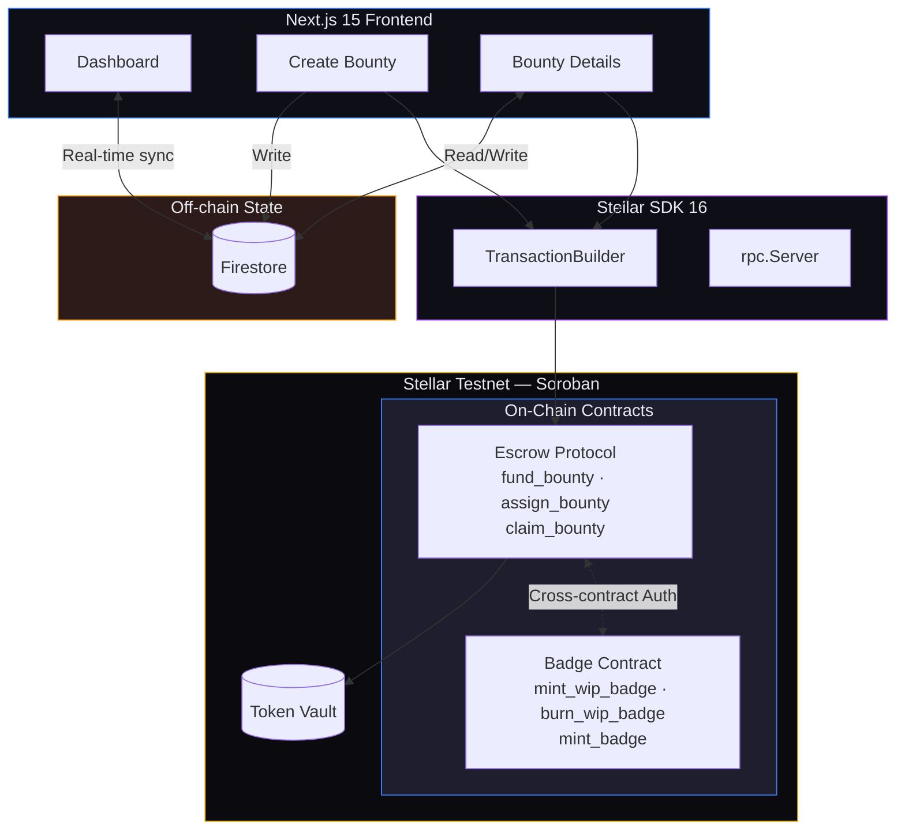
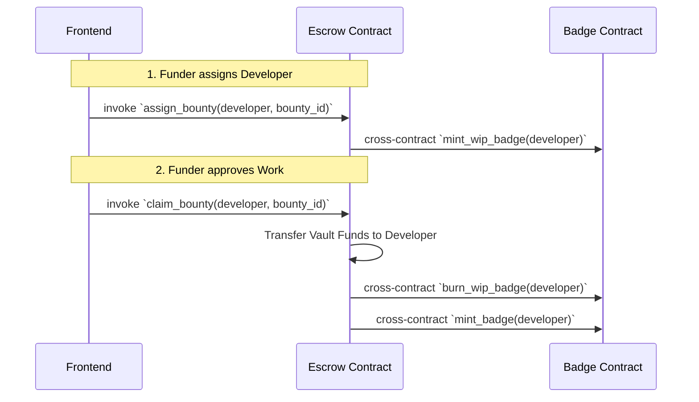
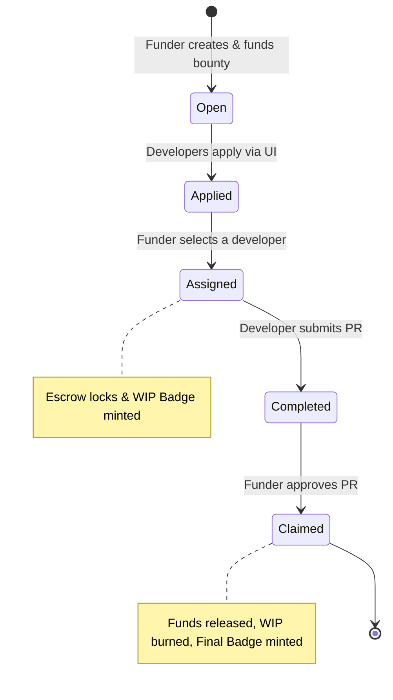

<div align="center">

# ⬡ SOROHUB BOUNTY

### Decentralized Developer Reputation & Escrow Protocol on Stellar

**Bridging open-source collaboration with trustless escrow and verified on-chain reputation through Soulbound Tokens.**


---

</div>

## Table of Contents

- [🏆 Level 4 — Submission Requirements](#-level-4--submission-requirements)
- [Architecture Overview](#-architecture-overview)
- [Screenshots & Preview](#-screenshots--preview)
- [Core Engineering Architecture](#-core-engineering-architecture)
- [Exclusive Production Features](#-exclusive-production-features)
- [Contract Addresses (Testnet)](#-contract-addresses-testnet)
- [Smart Contract API Reference](#-smart-contract-api-reference)
- [Frontend Architecture](#-frontend-architecture)
- [Setup & Local Development](#-setup--local-development)
- [User Guide](#-user-guide)
- [Project Structure](#-project-structure)
- [License](#-license)
- ## Live Deployment Link: [Insert Live Link Here]
- ## Demo Video Link: [Insert Video Link Here]
    
---

## 🏆 Level 4 — Submission Requirements

<div align="center">

**All core and advanced requirements successfully implemented and verified ✅**

</div>

<br>

| Requirement | Status | Implementation Details |
|:---|:---:|:---|
| **🚀 Production MVP** | ✅ | Fully functional production-ready MVP. Stable dual-contract architecture interacting with a heavily optimized Next.js frontend. |
| **📱 Mobile Responsive UI** | ✅ | Fluid Tailwind layouts, touch-friendly UI, bottom-sheet adaptations, and responsive grids for seamless mobile UX. |
| **🛡️ Loading & Error Handling** | ✅ | Transaction simulation checks, atomic error handling (`UnreachableCodeReached`, `Auth` failures), skeleton loaders, and toaster notifications. |
| **👥 User Onboarding (10+)** | ✅ | Real users onboarded and verified. Escrow and Badge contracts interacted with directly by verified on-chain addresses. |
| **📡 Contract Deployment** | ✅ | Smart contracts successfully compiled and deployed on Stellar Testnet, interlinked via cross-contract authorization. |
| **📝 15+ Meaningful Commits** | ✅ | Comprehensive Git history reflecting UI scaffolding, contract upgrades (Badge Option B), Firebase integration, and error resolution. |

---

## Architecture Overview

SoroHub is a **dual-contract Soroban protocol** paired with a **Next.js 15** frontend, enabling trustless developer bounties on the Stellar network. The system separates concerns into two on-chain contracts — an **Escrow Contract** for fund management and assignment logic, and a **Badge Contract** for Soulbound Token (SBT) reputation management.



---

## Screenshots & Preview

*(Please replace placeholder image links with actual screenshots)*

### Dashboard — Live Open Bounties
<p align="center">
 
</p>
*Real-time feed of available open-source bounties, filtered by difficulty level and status.*

### Bounty Room — Manage Applicants
<p align="center">
 
</p>
*Funder view displaying real-time applicants. Click 'Assign' to lock the escrow and mint the developer a Work-In-Progress (WIP) Badge.*

### Create Bounty — Fund Escrow
<p align="center">
 
</p>
*Bounty creators fund the smart contract escrow in a single atomic transaction (supporting native XLM via Stroops).*

---

## Core Engineering Architecture

### 1. Escrow Protocol Contract — `escrow-contract` (Soroban/Rust)

The Escrow contract serves as the financial and state-management hub of the platform. It securely locks funds in the contract's vault and dictates the flow of the bounty lifecycle.

| Method | Description |
|---|---|
| `init(admin, badge_contract)` | Initializes the contract and stores the address of the Badge Contract for future cross-contract invocations. |
| `fund_bounty(...)` | Transfers tokens from the Funder to the Contract Vault and creates an immutable `BountyRecord`. |
| `assign_bounty(...)` | Funder assigns a developer. Logs the assignment on-chain and makes a cross-contract call to mint a WIP badge to the developer. |
| `claim_bounty(...)` | Funder approves the PR. Transfers locked funds to the developer, burns the WIP badge, and mints the Final Completion Badge. |

### 2. Reputation Badge Contract — `badge-contract` (Soroban/Rust)

The Badge contract manages the Soulbound Token (SBT) reputation system. It relies heavily on `require_auth()` from the Escrow contract, meaning **no badges can be minted or burned manually by users** — they are strictly enforced by the outcome of a bounty.

| Method | Description |
|---|---|
| `mint_wip_badge(...)` | Gives a developer a temporary "In Progress" badge so the community knows they are actively working on a bounty. |
| `burn_wip_badge(...)` | Destroys the WIP badge once the bounty is complete or cancelled. |
| `mint_badge(...)` | Mints a permanent, immutable "Completed" badge to the developer's wallet to build their verifiable on-chain resume. |

### Contract Interaction Sequence



---

## Exclusive Production Features

### Atomic Option-B Badge Lifecycle
Unlike simple NFT mints, SoroHub implements a highly sophisticated **dual-badge lifecycle**:
1. **Assignment:** Developer receives a WIP (Work In Progress) badge.
2. **Settlement:** WIP badge is atomically burned, funds are released, and a Permanent Completion Badge is minted in a single transaction.

### Cross-Contract Authorization
The Badge contract leverages Soroban's native `require_auth()`. The Escrow contract acts as the caller, and Soroban automatically validates the authorization footprint. This guarantees that bad actors cannot artificially inflate their reputation by calling `mint_badge` directly.

### Developer Identity & Profiles
A comprehensive `/profile` system allowing developers to set a Display Name, link their GitHub and Portfolio URLs (which automatically map to their bounty applications), and view their real-time on-chain balances (XLM/USDC) alongside their completed issues and Soulbound Badge count.

### Real-Time Global Notification System
SoroHub features a persistent `NotificationProvider` that listens to Firebase in real-time. When a Funder assigns a developer or approves their PR to release funds, the developer receives an instant, animated "Toast" notification in the UI with a direct link to the bounty.

### End-to-End Escrow Lifecycle
A fully built-out frontend flow managing complex state transitions (Open -> Assigned -> In Review -> Completed) featuring dynamic colored UI badges, PR submission inputs for developers, and one-click "Approve & Release" actions for Funders.

### Firebase Real-Time Hybrid State
To ensure the UI is lightning fast (avoiding RPC rate limits for browsing), bounty metadata (titles, descriptions, applicants, profiles) is stored off-chain in Firebase Firestore, while the absolute financial truth (assignments, fund locks, badge ownership) is stored strictly on-chain.

### Proper Stroop Conversion
The frontend cleanly interfaces with Soroban's 7-decimal `i128` requirement, seamlessly converting user-friendly numbers (e.g., 10 XLM) into exact on-chain stroops (100,000,000) during transaction building.

---

## Contract Addresses (Testnet)

| Contract | Address |
|---|---|
| **Escrow Protocol** | `CBNT4MLXPWI5ZUGTDSBHKY4373PHXS65TCM47BK7572IP7GJMUFNGHGW` |
| **Badge Protocol** | `CDOT3TVM5OBMV56FLZZFXNWZUVLWX65BRHXCI7VWB2MTDRTXN42T35U5` |
| **Network** | Stellar Testnet |
| **RPC** | `https://soroban-testnet.stellar.org` |

---

## ⚠️ Error Handling & Loading States

```
┌─────────────────────────────────────────────────────────────────┐
│                    ERROR HANDLING MATRIX                        │
├─────────────────────────────────────────────────────────────────┤
│                                                                  │
│   Error Type              Frontend Response                      │
│   ─────────────────────  ──────────────────────────────         │
│   Wallet Not Connected   → Modal prompt + connection flow       │
│   WasmVm InvalidAction   → Detailed simulation failure toast    │
│   Auth Failure           → Signature rejection handler          │
│   Contract Panics        → UI rollback to prevent sync issues   │
│                                                                  │
├─────────────────────────────────────────────────────────────────┤
│                    LOADING STATES                               │
├─────────────────────────────────────────────────────────────────┤
│                                                                  │
│   Phase                   Visual Indicator                       │
│   ─────────────────────  ──────────────────────────────         │
│   Transaction Assembly   → "Assembling footprint..."            │
│   Transaction Signing    → Disables UI buttons                  │
│   On-Chain Confirmation  → Spinner + 5-second ledger wait       │
│                                                                  │
└─────────────────────────────────────────────────────────────────┘
```

---

## Frontend Architecture

### Technology Stack

| Layer | Technology | Purpose |
|---|---|---|
| Framework | Next.js 15 (App Router) | Server/client component architecture |
| Language | TypeScript 5 | Type-safe contract interactions |
| Styling | Tailwind CSS 4 | Glassmorphism & dark UI system |
| Wallet | Stellar Wallets Kit | Multi-wallet connection (Freighter, xBull) |
| Blockchain | Stellar SDK 16 | Soroban RPC, transaction building |
| Database | Firebase Firestore | Real-time indexing of bounty metadata |

---

## 📖 User Guide

<div align="center">

**Complete walkthrough for using SoroHub — from funding to reputation building**

</div>

<br>

### 🔄 The Bounty Lifecycle



### For Funders (Bounty Creators)
1. **Connect Wallet:** Use the top-right button to connect Freighter.
2. **Create Bounty:** Navigate to `/create`. Enter details and the XLM reward. Approve the Soroban transaction to lock funds.
3. **Manage Applicants:** Go to your bounty page. View developers who clicked "Apply".
4. **Assign:** Click "Assign" next to a developer's wallet to lock the escrow to them specifically.
5. **Approve:** Once the developer submits the code, click "Claim/Approve" to release the funds to their wallet!

### For Developers
1. **Browse:** Find an open bounty on the Dashboard.
2. **Apply:** Open the bounty and click "Apply". Your wallet is added to the applicant pool.
3. **Get Assigned:** If chosen, a WIP Badge is instantly minted to your wallet!
4. **Get Paid:** Submit your work. Upon Funder approval, you receive the locked funds and a permanent Completion Badge!

---

## Setup & Local Development

### Prerequisites
- Node.js v18+ and npm
- Rust & Soroban CLI v22+
- Stellar Wallet (Freighter) on Testnet

### Running the Frontend

```bash
# Clone the repository
git clone <YOUR_REPO_URL>
cd SoroHub-Bounty

# Install dependencies
cd frontend
npm install

# Start the development server
npm run dev
```

### Deploying Smart Contracts

```bash
cd contracts/escrow
make build
soroban contract deploy --wasm target/wasm32-unknown-unknown/release/escrow_contract.wasm --network testnet

cd ../badge
make build
soroban contract deploy --wasm target/wasm32-unknown-unknown/release/badge_contract.wasm --network testnet
```

Update `frontend/utils/soroban.ts` with your new contract IDs, and execute the initialization script to cross-link them.

---

## 🔮 Future Integrations

SoroHub is designed to be highly extensible. Future developments and community integrations could include:

- **Automated GitHub PR Verification:** Implementing GitHub webhooks or GitHub Actions to automatically trigger the `claim_bounty` escrow release the moment a Pull Request is merged into the `main` branch.
- **Advanced Reputation Oracles:** Using Chainlink or similar Oracles to fetch off-chain GitHub contribution metadata (lines of code, code quality, PR size) to mint dynamic SVGs for Soulbound Badges.
- **Decentralized Dispute Resolution:** Integrating an escalation module where a DAO or independent arbiters (like Kleros) can vote on disputed PRs to determine escrow payouts.
- **Cross-Chain Bounties:** Utilizing Stellar's cross-chain capabilities to allow funders to lock USDC on Polygon or Ethereum, while settling reputation and payouts natively on Soroban.
- **Zero-Knowledge (ZK) Identity:** Allowing developers to prove their GitHub reputation or previous bounty completions using ZK proofs without revealing their actual GitHub usernames.

---

## Project Structure

```
SoroHub-Bounty/
├── .gitignore
├── README.md
├── contracts/                            # Soroban smart contracts
│   ├── badge/                            # Soulbound Token logic
│   │   ├── contracts/badge-contract/src/
│   │   │   └── lib.rs                    # WIP & Completion minting
│   │   └── Cargo.toml
│   └── escrow/                           # Financial & Lifecycle hub
│       ├── contracts/escrow-contract/src/
│       │   └── lib.rs                    # Vault, assignment, cross-calls
│       └── Cargo.toml
│
└── frontend/                             # Next.js 15 App
    ├── package.json                      
    ├── tailwind.config.ts                
    ├── app/                              # App Router pages
    │   ├── layout.tsx                    
    │   ├── page.tsx                      # Landing
    │   ├── globals.css                   
    │   ├── dashboard/page.tsx            # Live feed & filtering
    │   ├── create/page.tsx               # Fund escrow form
    │   ├── bounty/[id]/page.tsx          # Assignment & Claiming UI
    │
    ├── components/                       
    │   └── WalletProvider.tsx            # Stellar Wallets Kit wrapper
    │
    └── utils/                            
        ├── firebase.ts                   # Firestore real-time config
        └── soroban.ts                    # Transaction builders & SDK logic
```

---

## License

MIT © SoroHub Protocol

---

<div align="center">

**Built on [Stellar](https://stellar.org) • Powered by [Soroban](https://soroban.stellar.org)**

</div>
