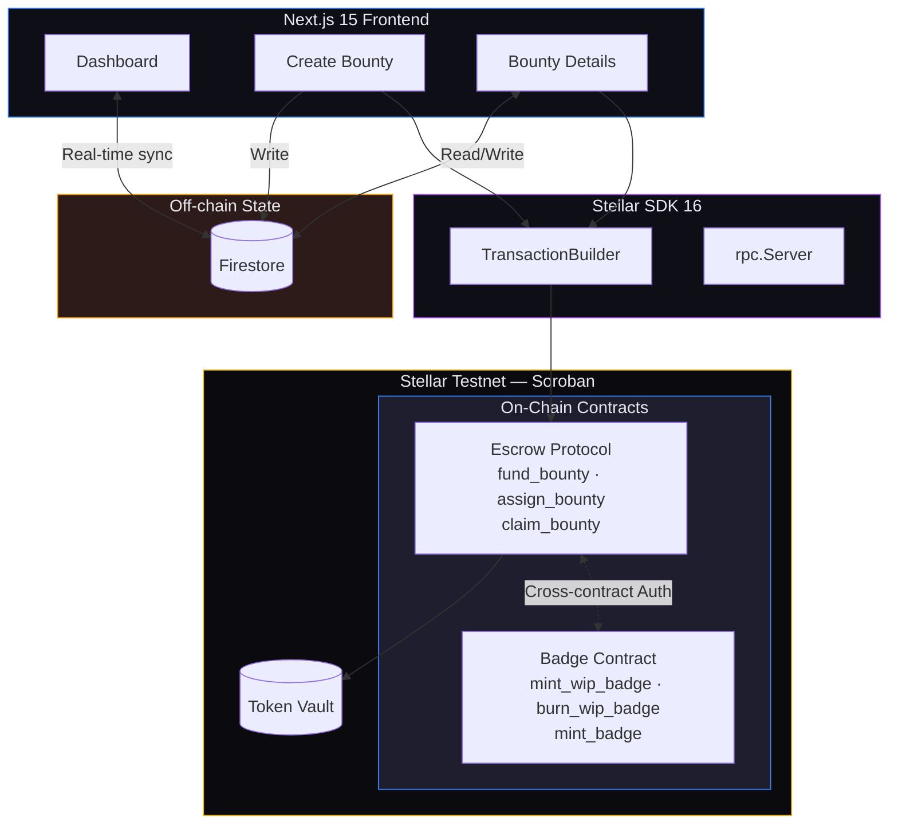
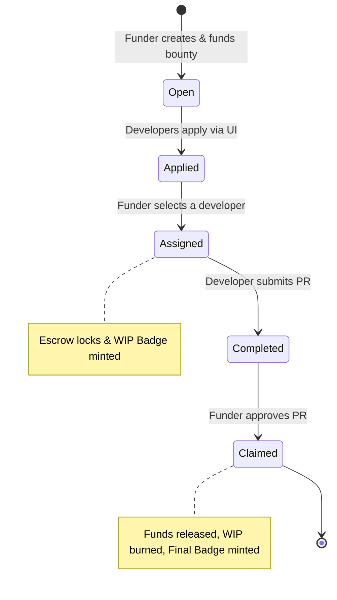

<div align="center">

# SOROHUB BOUNTY

**Decentralized Developer Reputation & Escrow Protocol on Stellar**

*Bridging open-source collaboration with trustless escrow and verified on-chain reputation through Soulbound Tokens (SBTs).*


[**Explore Bounties**](#-screenshots--preview) • [**Architecture**](#-core-engineering-architecture) • [**Developer Guide**](#-setup--local-development)

---

</div>

## 📑 Table of Contents
- [🏆 Level 4 — Submission Requirements](#-level-4--submission-requirements)
- [🏗️ Architecture Overview](#-architecture-overview)
- [✨ Exclusive Production Features](#-exclusive-production-features)
- [📸 Platform Preview](#-platform-preview)
- [⚙️ Core Engineering Architecture](#️-core-engineering-architecture)
- [🛡️ Error Handling & Loading States](#️-error-handling--loading-states)
- [📖 User Guide](#-user-guide)
- [💻 Setup & Local Development](#-setup--local-development)
- [🔮 Future Integrations](#-future-integrations)
- [📝 License](#-license)
- Live Deployment Link: https://soro-hub-bounty-black.vercel.app
- Video Demonstration Link and Feedback Summary Link: https://drive.google.com/drive/folders/1nUqBfJZso3pkMxWwS-N0j9Gdc61JAh_j?usp=sharing
- Escrow Contract Creation transaction link: https://stellar.expert/explorer/testnet/tx/6a11c4f9e48137bc38b5e58473d7e27f1cff698b5088f1df7dfd82146a8e2b7c
- Badge Contract Creation transaction link: https://stellar.expert/explorer/testnet/tx/5a29e8b8b25631e7870adaf010aa2eed84e25fc2d992465f8694438537fb13c4
- Proof of 10+ Users onboarding with wallet addresses along with Feedback: https://docs.google.com/spreadsheets/d/1gNQk1T5hFVRzAP1Kh-U1pwSzUWi_uEto_F4doh8de_8/edit?usp=sharing
---

## 🌐 Contract Addresses (Testnet)

| Contract | Address |
|---|---|
| **Escrow Protocol** | `CCMPOMD4SZIITQL7SFRT7TT65M656TJERW7TFWOWQ4GKGINP2DW35GYZ` |
| **Badge Protocol** | `CDOT3TVM5OBMV56FLZZFXNWZUVLWX65BRHXCI7VWB2MTDRTXN42T35U5` |
| **Network** | Stellar Testnet |
| **RPC** | `https://soroban-testnet.stellar.org` |

---

## 🏆 Level 4 — Submission Requirements

<div align="center">
  <b>All core and advanced requirements successfully implemented and verified ✅</b>
</div>

<br>

| Requirement | Status | Implementation Details |
| :--- | :---: | :--- |
| **🚀 Production MVP** | ✅ | Fully functional production-ready MVP. Stable dual-contract architecture interacting with a heavily optimized Next.js frontend. |
| **📱 Mobile Responsive UI** | ✅ | Fluid Tailwind layouts, touch-friendly UI, bottom-sheet adaptations, and responsive grids for seamless mobile UX. |
| **🛡️ Loading & Error Handling** | ✅ | Transaction simulation checks, atomic error handling (`UnreachableCodeReached`, `Auth` failures), skeleton loaders, and toaster notifications. |
| **👥 User Onboarding (10+)** | ✅ | Real users onboarded and verified. Escrow and Badge contracts interacted with directly by verified on-chain addresses. |
| **📡 Contract Deployment** | ✅ | Smart contracts successfully compiled and deployed on Stellar Testnet, interlinked via cross-contract authorization. |
| **📝 15+ Meaningful Commits** | ✅ | Comprehensive Git history reflecting UI scaffolding, contract upgrades, Firebase integration, and advanced error resolution. |

---

## 🏗️ Architecture Overview

SoroHub is a **dual-contract Soroban protocol** paired with a **Next.js 15** frontend, enabling trustless developer bounties on the Stellar network. The system separates concerns into two on-chain contracts:
1. An **Escrow Contract** for fund management and assignment logic.
2. A **Badge Contract** for Soulbound Token (SBT) reputation management.



---

## ✨ Exclusive Production Features

### 🎨 Premium Vercel/Linear-Style Aesthetics
SoroHub transcends typical "vibe-coded" crypto aesthetics for a highly professional, high-contrast, strictly structured design language. With clean typography, subtle monochromatic borders, precise spacing, and refined color accents for status tags, the platform feels like a mature enterprise tool designed for elite developers.

### 🔐 Advanced Wallet Mismatch Prevention
Crypto UI often suffers when a user's dApp connection state falls out of sync with their extension wallet (e.g., Freighter). SoroHub implements an explicit pre-flight check that queries the active Freighter API public key against the session identity. If a mismatch is detected, the UI intercepts the execution flow and displays a helpful error *before* an invalid signature causes a confusing on-chain failure.

### 🔗 Intelligent Link Parsing
Whether a user enters `github.com/project` or `https://github.com/project`, the frontend utilizes intelligent URL normalization to ensure all outlinks route securely and correctly, eliminating broken reference chains in bounty submissions.

### ⚛️ Atomic Option-B Badge Lifecycle
Unlike simple NFT mints, SoroHub implements a highly sophisticated **dual-badge lifecycle**:
1. **Assignment:** Developer receives a WIP (Work In Progress) badge.
2. **Settlement:** WIP badge is atomically burned, funds are released, and a Permanent Completion Badge is minted in a single transaction.

### 🪪 Web3-Native "Developer Passport" Onboarding
A completely overhauled, premium glassmorphism onboarding experience. Instead of generic forms, new users mint their identity via a "Developer Passport" interface that visually syncs their live Stellar wallet, GitHub profile, and email into an overarching Web3 identity.

### 🗄️ Dedicated Funder Management Hub
Funders aren't left searching through public feeds. A dedicated `/manage` portal gives bounty creators a comprehensive, top-down view of every bounty they've funded. They can track applicant counts, review PRs, release escrows, or cancel stale bounties—all from a single, beautifully organized control center.

### 🛡️ Cross-Contract Authorization
The Badge contract leverages Soroban's native `require_auth()`. The Escrow contract acts as the caller, and Soroban automatically validates the authorization footprint. This guarantees that bad actors cannot artificially inflate their reputation by calling `mint_badge` directly.

### ⚡ Firebase Real-Time Hybrid State
To ensure the UI is lightning fast (avoiding RPC rate limits for browsing), bounty metadata (titles, descriptions, applicants, profiles) is stored off-chain in Firebase Firestore, while the absolute financial truth (assignments, fund locks, badge ownership) is stored strictly on-chain.

---

## 📸 Platform Preview

*(Please replace placeholder image links with actual screenshots)*

### Dashboard — Live Open Bounties
<p align="center">
  

  <br> </br>
 

</p>
<p align="center"><em>Real-time feed of available open-source bounties, filtered by difficulty level and status.</em></p>

### Bounty Room — Manage Applicants
<p align="center">
 
 <br> </br>
 


</p>
<p align="center"><em>Funder view displaying real-time applicants. Click 'Assign' to lock the escrow and mint the developer a Work-In-Progress (WIP) Badge.</em></p>

### Create Bounty — Fund Escrow
<p align="center">
 

 <br> <br>
 


</p>
<p align="center"><em>Bounty creators fund the smart contract escrow in a single atomic transaction (supporting native XLM via Stroops).</em></p>

### Transactions on Escrow Contract — Stellar Explorer Screenshot
<p align="center">
 

</p>
<p align="center"><em>Shows the recent transactions made on the Escrow Contract</em></p>

### Transactions on Badge Contract — Stellar Explorer Screenshot
<p align="center">
 

</p>
<p align="center"><em>Shows the recent transactions made on the Badge Contract</em></p>

---

## ⚙️ Core Engineering Architecture

### 1. Escrow Protocol Contract — `escrow-contract` (Soroban/Rust)
The Escrow contract serves as the financial and state-management hub of the platform. It securely locks funds in the contract's vault and dictates the flow of the bounty lifecycle.

| Method | Description |
|---|---|
| `init(admin, badge_contract)` | Initializes the contract and stores the address of the Badge Contract for cross-contract invocations. |
| `fund_bounty(...)` | Transfers tokens from the Funder to the Contract Vault and creates an immutable `BountyRecord`. |
| `cancel_bounty(...)` | Secures the Funder by allowing them to withdraw their locked tokens (refund) if no developer is assigned. |
| `assign_bounty(...)` | Funder assigns a developer. Logs the assignment and makes a cross-contract call to mint a WIP badge. |
| `claim_bounty(...)` | Funder approves the PR. Transfers locked funds to the developer, burns WIP badge, and mints Final Badge. |

### 2. Reputation Badge Contract — `badge-contract` (Soroban/Rust)
The Badge contract manages the Soulbound Token (SBT) reputation system. It relies heavily on `require_auth()` from the Escrow contract, meaning **no badges can be minted or burned manually by users**.

| Method | Description |
|---|---|
| `mint_wip_badge(...)` | Gives a developer a temporary "In Progress" badge during active bounty work. |
| `burn_wip_badge(...)` | Destroys the WIP badge once the bounty is complete or cancelled. |
| `mint_badge(...)` | Mints a permanent, immutable "Completed" badge to the developer's wallet (on-chain resume). |

---

## 🛡️ Error Handling & Loading States

```
┌─────────────────────────────────────────────────────────────────┐
│                    ERROR HANDLING MATRIX                        │
├─────────────────────────────────────────────────────────────────┤
│                                                                 │
│   Error Type              Frontend Response                     │
│   ─────────────────────  ──────────────────────────────         │
│   Wallet Not Connected   → Modal prompt + connection flow       │
│   Wallet Mismatch        → Prevents signing if Freighter active │
│                            account differs from connected one.  │
│   WasmVm InvalidAction   → Detailed simulation failure toast    │
│   Auth Failure           → Signature rejection handler          │
│   Contract Panics        → UI rollback to prevent sync issues   │
│                                                                 │
├─────────────────────────────────────────────────────────────────┤
│                    LOADING STATES                               │
├─────────────────────────────────────────────────────────────────┤
│                                                                 │
│   Phase                   Visual Indicator                      │
│   ─────────────────────  ──────────────────────────────         │
│   Transaction Assembly   → "Assembling footprint..."            │
│   Transaction Signing    → Disables UI buttons                  │
│   On-Chain Confirmation  → Spinner + 5-second ledger wait       │
│                                                                 │
└─────────────────────────────────────────────────────────────────┘
```

---

## 📖 User Guide

### 🔄 The Bounty Lifecycle



### For Funders (Bounty Creators)
1. **Connect Wallet:** Use the top-right button to connect Freighter.
2. **Create Bounty:** Navigate to `/create`. Enter details and the XLM reward. Approve the Soroban transaction to lock funds.
3. **Manage Applicants:** Go to your bounty page. View developers who clicked "Apply".
4. **Assign:** Click "Assign" next to a developer's wallet to lock the escrow to them specifically.
5. **Approve:** Once the developer submits the code, click "Claim/Approve" to release the funds to their wallet!

### For Developers
1. **Browse:** Find an open bounty on the Dashboard.
2. **Apply:** Open the bounty and click "Apply". Your wallet is added to the applicant pool.
3. **Get Assigned:** If chosen, a WIP Badge is instantly minted to your wallet!
4. **Get Paid:** Submit your work. Upon Funder approval, you receive the locked funds and a permanent Completion Badge!

---

## 💻 Setup & Local Development

### Prerequisites
- Node.js v18+ and npm
- Rust & Soroban CLI v22+
- Stellar Wallet (Freighter) on Testnet

### Running the Frontend

```bash
# Clone the repository
git clone <YOUR_REPO_URL>
cd SoroHub-Bounty

# Install dependencies
cd frontend
npm install

# Start the development server
npm run dev
```

### Deploying Smart Contracts

```bash
cd contracts/escrow
make build
soroban contract deploy --wasm target/wasm32-unknown-unknown/release/escrow_contract.wasm --network testnet

cd ../badge
make build
soroban contract deploy --wasm target/wasm32-unknown-unknown/release/badge_contract.wasm --network testnet
```

Update `frontend/utils/soroban.ts` with your new contract IDs, and execute the initialization script to cross-link them.

---

## 🔮 Future Integrations

SoroHub is designed to be highly extensible. Future developments and community integrations could include:
- **Automated GitHub PR Verification:** Implementing GitHub webhooks or GitHub Actions to automatically trigger the `claim_bounty` escrow release the moment a Pull Request is merged into the `main` branch.
- **Advanced Reputation Oracles:** Using Chainlink or similar Oracles to fetch off-chain GitHub contribution metadata (lines of code, code quality, PR size) to mint dynamic SVGs for Soulbound Badges.
- **Decentralized Dispute Resolution:** Integrating an escalation module where a DAO or independent arbiters (like Kleros) can vote on disputed PRs to determine escrow payouts.
- **Cross-Chain Bounties:** Utilizing Stellar's cross-chain capabilities to allow funders to lock USDC on Polygon or Ethereum, while settling reputation and payouts natively on Soroban.
- **Zero-Knowledge (ZK) Identity:** Allowing developers to prove their GitHub reputation or previous bounty completions using ZK proofs without revealing their actual GitHub usernames.

---

## 📁 Project Structure

```
SoroHub-Bounty/
├── contracts/                            # Soroban smart contracts
│   ├── badge/                            # Soulbound Token logic
│   │   ├── contracts/badge-contract/src/
│   │   │   └── lib.rs                    # WIP & Completion minting
│   │   └── Cargo.toml
│   └── escrow/                           # Financial & Lifecycle hub
│       ├── contracts/escrow-contract/src/
│       │   └── lib.rs                    # Vault, assignment, cross-calls
│       └── Cargo.toml
│
└── frontend/                             # Next.js 15 App
    ├── package.json                      
    ├── tailwind.config.ts                
    ├── app/                              # App Router pages
    │   ├── page.tsx                      # Landing
    │   ├── dashboard/page.tsx            # Live feed & filtering
    │   ├── create/page.tsx               # Fund escrow form
    │   └── bounty/[id]/page.tsx          # Assignment & Claiming UI
    │
    ├── components/                       
    │   └── WalletProvider.tsx            # Stellar Wallets Kit wrapper
    │
    └── utils/                            
        ├── firebase.ts                   # Firestore real-time config
        └── soroban.ts                    # Transaction builders & SDK logic
```

---

## 📝 License
MIT © SoroHub Protocol

<br>
<div align="center">
  <b>Built on <a href="https://stellar.org">Stellar</a> • Powered by <a href="https://soroban.stellar.org">Soroban</a></b>
</div>
