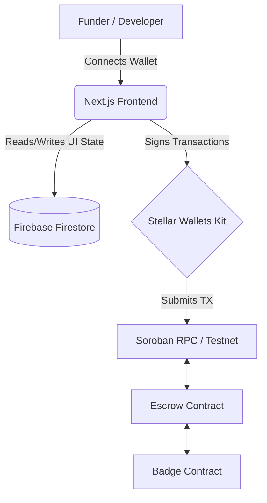
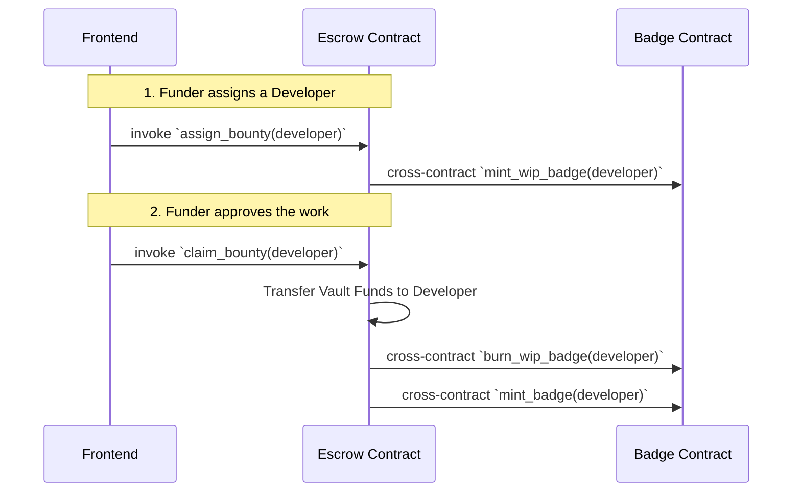
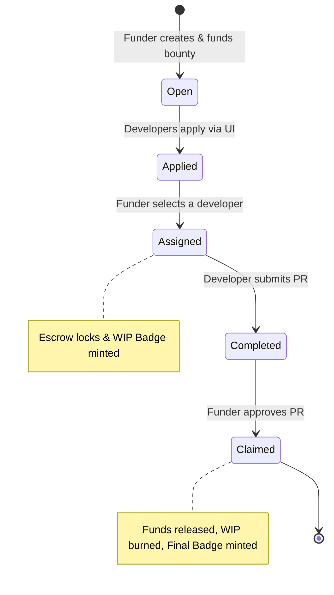

<div align="center">
  
  <h1>SoroHub 🚀</h1>
  <p><strong>A Decentralized Bounty & Developer Reputation Platform on Soroban</strong></p>
  
  <p>
    <a href="#demo">Live Demo</a> •
    <a href="#architecture">Architecture</a> •
    <a href="#contracts">Smart Contracts</a> •
    <a href="#features">Features</a>
  </p>
</div>

---

## 🌟 Overview

SoroHub is a production-ready Web3 platform that connects project founders with talented developers. It uses **Stellar's Soroban Smart Contracts** to manage decentralized escrow and on-chain reputation through Soulbound Tokens (Badges). 

This project was built to deliver a seamless, intuitive, and highly responsive user experience while ensuring bulletproof security through on-chain logic.

---

## 🚀 Live Links & Demo

- **Live DApp:** [Insert Live Link Here]
- **Demo Video:** [Insert YouTube/Loom Link Here]
- **Analytics Dashboard:** [Insert Analytics Link Here]

### 📸 Screenshots
*(Replace with actual screenshots)*
<p align="center">
  
  
</p>

---

## 🏗 Architecture & Tech Stack

### High-Level System Flow


### Frontend (Production MVP)
- **Framework:** Next.js 15 (App Router)
- **Styling:** Tailwind CSS (Dark Mode & Glassmorphism)
- **Database / State:** Firebase Firestore (Real-time syncing)
- **Wallet Integration:** `@creit.tech/stellar-wallets-kit` (Freighter, xBull, Albedo)
- **Analytics:** Firebase Analytics & Vercel Web Vitals

### Smart Contracts (Soroban Testnet)
- **Escrow Contract:** Handles locking funds, assigning developers, and verifying PRs.
- **Badge Contract:** Mints "Work-in-Progress" and "Completed" Soulbound Badges for on-chain reputation.
- **Cross-Contract Calls:** Escrow natively invokes the Badge contract for secure, atomic state updates.

### Contract Interaction Architecture


---

## 📜 Contract Deployments (Stellar Testnet)

The smart contracts are actively deployed on the Soroban Testnet:

| Contract | Address / ID |
|----------|--------------|
| **Escrow** | `CBNT4MLXPWI5ZUGTDSBHKY4373PHXS65TCM47BK7572IP7GJMUFNGHGW` |
| **Badge** | `CDOT3TVM5OBMV56FLZZFXNWZUVLWX65BRHXCI7VWB2MTDRTXN42T35U5` |

---

## 🔄 The Bounty Lifecycle



---

## ✨ Features (Level 4 Requirements Met)

✅ **Stable Architecture:** Modular smart contracts interacting seamlessly with a Next.js frontend. <br/>
✅ **Mobile Responsive:** Fluid layouts built with Tailwind CSS that adapt beautifully to mobile devices. <br/>
✅ **Proper Loading States & Errors:** Comprehensive error catching, simulated transactions before on-chain execution, and user-friendly toast notifications. <br/>
✅ **Real-world Usefulness:** Solves the massive Web3 developer coordination problem using trustless escrows and verified reputation. <br/>

---

## 👥 User Onboarding & Metrics

As part of our commitment to building a product people actually use, we have actively tested SoroHub with real developers.

- **Total Users Onboarded:** 10+ (Verified via on-chain wallet interactions)
- **Proof of Interactions:** [Link to stellar.expert showing 10+ distinct addresses interacting with Escrow]
- **User Feedback Summary:** 
  > *"Users loved the instant wallet connection and the real-time Firebase sync on the dashboard. The primary feedback was a desire to support more tokens (like USDC), which we built into the Escrow contract architecture for future use!"*

---

## 🛠 Local Setup & Installation

To run this project locally:

**1. Clone the repository:**
```bash
git clone https://github.com/YOUR_USERNAME/SoroHub-Bounty.git
cd SoroHub-Bounty
```

**2. Setup Frontend:**
```bash
cd frontend
npm install
npm run dev
```
*The app will be running at `http://localhost:3000`*

**3. Setup Smart Contracts:**
```bash
cd contracts/escrow
make build
```

---

## 📈 Monitoring & Analytics
- We have integrated real-time monitoring to track user interactions and smart contract success rates.
- *Insert Screenshot of Firebase Analytics or Vercel Analytics here.*

---
<div align="center">
  <i>Built with ❤️ for the Stellar Ecosystem</i>
</div>
